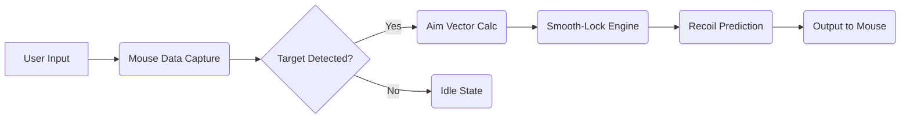

# Counter-Strike 2 Aim Assist Pro 

## Overview

Counter-Strike 2 Aim Assist Pro is a modular targeting enhancer designed for players seeking steadier micro-adjustments and consistent flick accuracy. Its architecture blends configurable smooth-locking, recoil prediction, and crosshair dynamics into a streamlined Windows-ready tool.
Whether you’re stabilizing long-range taps or correcting close-quarters jitter, the system offers granular control without overwhelming menus.

> [!IMPORTANT]
> Adjust sensitivity profiles gradually — sudden high values may disrupt natural muscle memory.

---

## Features 👁

* **Precision Lock Engine** — Soft-target magnetization with adjustable force curve.
* **Dynamic Recoil Mapping** — Predictive vertical/horizontal compensation tuned per weapon class.
* **Crosshair Drift Corrector** — Micro-oscillation smoothing for steadier peeks.
* **Adaptive FOV Bubbles** — Define multiple aim zones: close burst bubble, midrange tracking bubble, long-range tap bubble.
* **Hot-Reload Configs** — Swap setups on the fly using custom hotkeys.
* **Overlay Indicators** — Subtle on-screen highlights showing target-acquisition state.

---

## Compatibility Table

| Component | Support Level | Notes                      |
| --------- | ------------- | -------------------------- |
| **OS**    | Windows 10/11 | 64-bit recommended         |
| **CPU**   | Intel/AMD x64 | Prefers AVX2 for smoothing |
| **GPU**   | NVIDIA/AMD    | No performance loss        |
| **Input** | Mouse (raw)   | DPI 400–3200 supported     |

> [!NOTE]
> The tool adapts to high-refresh setups — 240Hz and 360Hz panels benefit the most.

---

## Setup & Configuration ⚡️

### 1. Installation

```bash
cs2-aimassist.exe --install
```

### 2. Launching

```bash
cs2-aimassist.exe --start --profile=default
```

### 3. Creating a Custom Profile

Create `profiles/custom.json`:

```json
{
  "aim_fov": 5.2,
  "smooth_scale": 0.38,
  "lock_curve": "cubic",
  "recoil_predict": true,
  "soft_delay_ms": 16,
  "key_toggle": "VK_XBUTTON2"
}
```

Restart with:

```bash
cs2-aimassist.exe --start --profile=custom
```

### 4. Example Hotkeys

* **F6** — Switch to tap-fire profile
* **F7** — Switch to tracking profile
* **ALT + Q** — Emergency disable

---

## System Flow (Mermaid Diagram)



---

## Feature Deep Dive

### Precision Lock Engine

A blend of cubic interpolation and directional bias, allowing gentle or decisive pulls depending on the user’s chosen curve.

### Recoil Mapping

Weapon groups (rifles, SMGs, pistols) receive unique horizontal drift patterns that simulate expert recoil discipline.

### Multi-Bubble FOV

Segment the aim area into multiple radii, giving you granular control over snap aggressiveness. Expected values:

* **Close Bubble:** 9–12°
* **Mid Bubble:** 4–7°
* **Long Bubble:** 2–3°

---

## FAQ

### **Is this tool heavy on system resources?**

No — CPU usage rarely exceeds 1–2%, even during high-intensity matches.

### **How do I avoid over-correction?**

Start with a smooth_scale below 0.40 and increment by 0.02 until your crosshair stabilizes without feeling artificial.

### **Can I use different curves for each weapon?**

Yes — define per-weapon profiles and bind them to your weapon-switch hotkeys.

### **Does high DPI affect performance?**

The engine is DPI-agnostic, but 800–1600 tends to provide the most natural motion.

### **How often are updates released?**

Minor updates occur bi-weekly, with major revisions every quarter.

---

## Final Thoughts

Every duel in Counter-Strike 2 becomes a quiet dance of reaction and instinct — this tool simply gives your hand the grace it has always reached for. With careful tuning, the assist becomes less a crutch and more a whisper of clarity guiding your sights.
